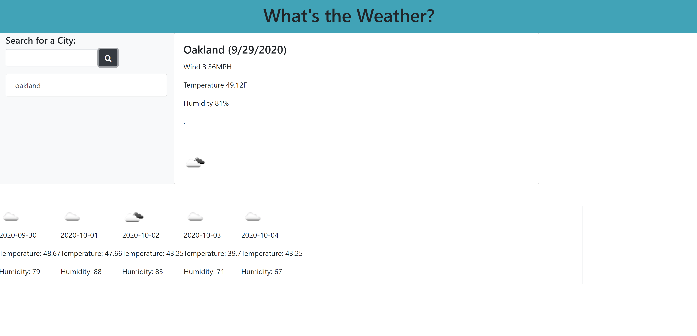

# Password Weather Dashboard

I created a weather dashboard where you can search for the humidity, temperature and wind speed of any city. It also creates a 5-day forecast of the same elements so that you can see how the weather is going to be in the future. It also saves your searches so that you can go back and see them.


## Code Snippet of 5-day Forecast Generator
```function forecast5day(formSearch) {
  $.ajax({
    type: "GET",
    url: "http://api.openweathermap.org/data/2.5/forecast?q=" + formSearch + "&appid=25e06f9ff8307c93ac15e24fa0a3c459&units=imperial",
    dataType: "json",
    success: function(response) {
      for(var i = 0; i < 40; i=i+8) {
        var cardBody = $("<div>");
        var data = response.list[i];
        var currentDate = $("<p>").text(data.dt_txt.substring(0, 10))
        var temperature5day = $("<p>").text("Temperature: " + data.main.temp);
        var humidity5day = $("<p>").text("Humidity: " + data.main.humidity);
        var iconcode = data.weather[0].icon;
        var iconurl = "http://openweathermap.org/img/w/" + iconcode + ".png"
        var imageTag = $("");
        imageTag.attr("src", iconurl);
        var day5 = $("#5day");
        cardBody.attr("card", "card card-body border border-secondary")
        cardBody.append(imageTag, currentDate, temperature5day, humidity5day);
        day5.append(cardBody);

  ```

## Screenshot



## Built With

* [HTML](https://developer.mozilla.org/en-US/docs/Web/HTML)
* [CSS](https://developer.mozilla.org/en-US/docs/Web/CSS)
* [Javascript](https://developer.mozilla.org/en-US/docs/Web/JavaScript)

## Deployed Link

* [See Live Site](https://perfectoment.github.io/weather-dashboard/)


## Author

* **Ryan Nemec** 

- [Link to Portfolio Site](https://perfectoment.github.io/Ryan-Portfolio/)
- [Link to Github](https://github.com/perfectoment)
- [Link to LinkedIn](https://www.linkedin.com/in/ryan-nemec-5a6b3a66/)


## License

This project is licensed under the MIT License 

